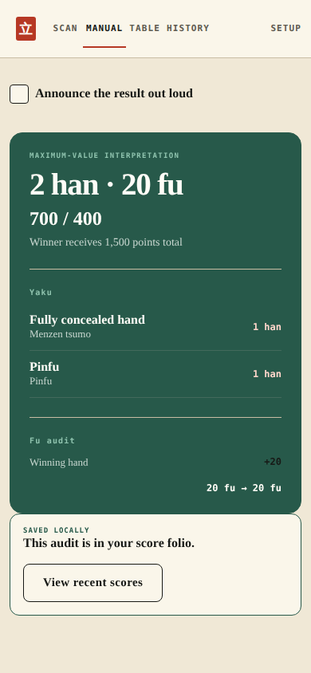
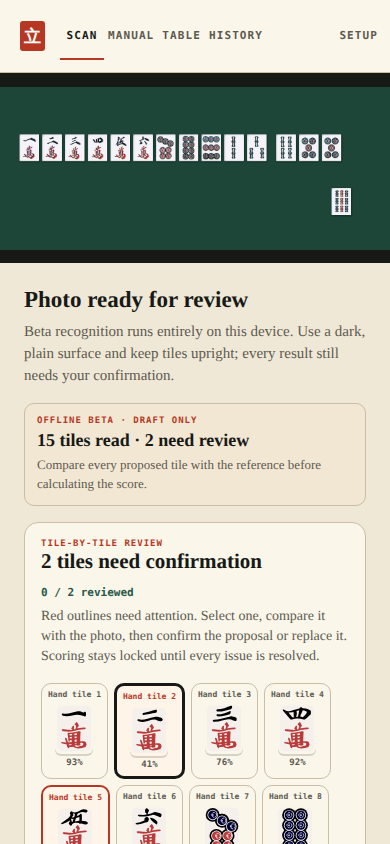
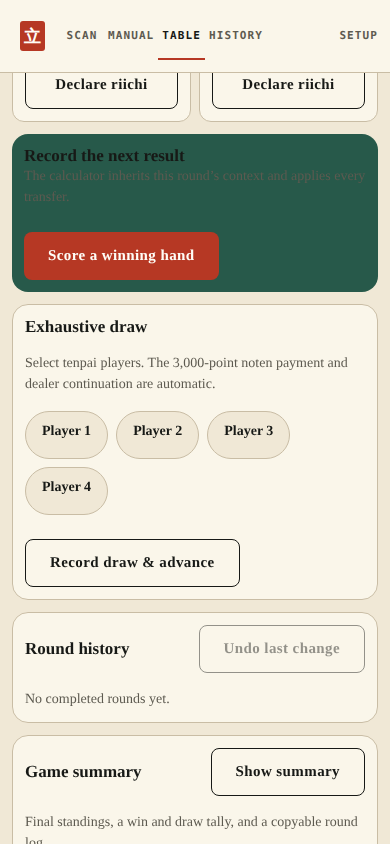
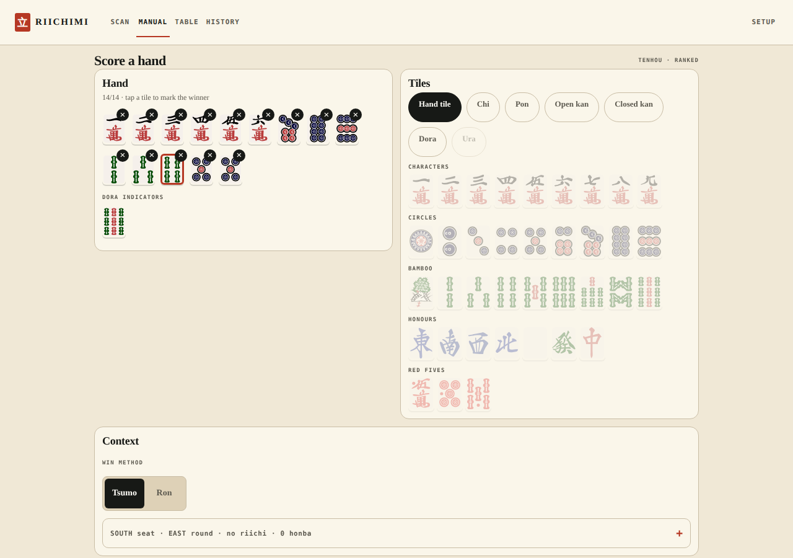

# Riichimi

Score a riichi mahjong hand at the table. Point a camera at the tiles or tap them in, and get the han, fu, and exact payments with every point explained. Everything runs on the device.

**[Try it](https://gyng.github.io/riichimi/)** · no install, no account, works offline after first load.

<p align="center">
  
  
  
</p>

## What it does

- **Reads the tiles.** A photo becomes a hand, offline. Every read is shown with its confidence and nothing scores until you confirm it.
- **Explains the score.** Han, fu, yaku, and who pays what — not just a number.
- **Runs the table.** Riichi sticks, honba, dealer rotation, transfers, and undo. Any round can be re-scored, and later rounds are replayed.
- **Follows your rules.** Tenhou, EMA, M.League, JPML A, WRC — or your table's own house rules.
- **Speaks four languages.** English, 日本語, 简体中文, 繁體中文.

<p align="center">
  
</p>

## Run it

```sh
npm install
npm run web
```

`npm start` opens the Expo menu; `npm run android` / `npm run ios` target a simulator.

Native recognition uses ONNX Runtime React Native, so it needs an Expo development build rather than Expo Go. On web the model loads only when you ask for a read.

## Checks

```sh
npm run check        # format, lint, typecheck, both test suites with coverage floors
npm run build:web
npm run test:e2e     # browser dogfood against the real export and the real model
npm run screenshots  # regenerate the images above by driving the app
```

## Layout

```text
apps/client            Expo + React 19 application
packages/score-core    Mahjong scoring. No React, no clock, no storage.
packages/session-core  Table progression as an event log with pure replay
packages/rules         Ruleset profiles, each citing a primary source
packages/vision        Recognition contracts and post-processing
packages/ui            Shared components
docs                   Plan, architecture, decisions, testing strategy
```

## Honest limits

Recognition is a **review-gated beta**. It reaches 93.48% top-1 on a 46-crop physical set, and 100% accuracy among reads it accepts above its own threshold — which is why nothing scores without your confirmation. That figure is not production accuracy, and [the model audit](docs/recognition-model-audit.md) says exactly what it is and is not.

Mahjong Soul is deliberately absent from the rulesets: two of its options are not stated on its official page, and it is the one ruleset paying single-yaku double yakuman, which the engine does not detect. [Why that matters](docs/rules-profiles.md).

The translations are machine-produced and have not been read by a player in those languages.

## Credits

Tile art from [FluffyStuff/riichi-mahjong-tiles](https://github.com/FluffyStuff/riichi-mahjong-tiles), public domain under CC0. See [tile art](docs/tile-art.md) for how it is prepared.

[Contributing](CONTRIBUTING.md) · [Engineering instructions](AGENTS.md) · [Security](SECURITY.md)
